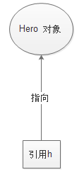
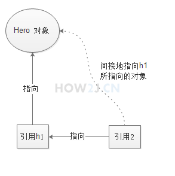
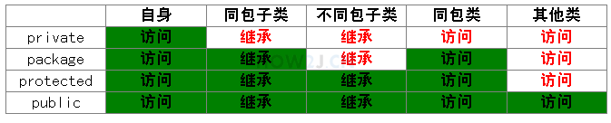

# Java Basics - Class and Object

## Reference
- if a variable' type is `class type` rather than basic type, then the `variable is also called` a reference

    
- many references but only one object
    
    ```java
    Hero h1 = new Hero();
    Hero a1 = h1;
    Hero a2 = h1;
    Hero a3 = a2;
    // four references h1,a1,a2,a3 all points to the same object
    ```
- `one reference` at the same time can `only points to one object`
## Inheritance
- a `subclass (derived class)` can **reuse the attributes and methods** of a `superclass (base class)`, and `extend` or `override` the superclass's functionality to achieve code reuse and hierarchical design
- `override`
    - After a subclass inherits from a superclass
    - Creates a method with `the exact same name`,`parameters` and `return type` as the superclass to `replace the superclass's original logic`
    ```java
    // Superclass
    class Animal {
        public void makeSound() {
            System.out.println("Animal makes sound");
        }
    }

    // Subclass overrides superclass method
    class Dog extends Animal {
        // @Override annotation: Verify override correctness (optional but recommended)
        @Override
        public void makeSound() {
            // Replace superclass logic with "dog barks"
            System.out.println("Woof woof woof");
        }
    }
    ```
## Overload
- `overload != override`
- In the same class, there are **multiple methods** with the `same name but different parameters` (different **count/type/order**)
- When *Method A* is called, the corresponding method is `automatically invoked` ***based on the*** `type` and `number of parameters` passed
- `no` such annotations `"@Overload"`
    - @Override is a "validation sticker": Overriding requires the `subclass method to exactly match the superclass` (name/parameters/return type). This annotation lets the compiler immediately check if the method truly overrides the superclass method — it’s for `"error correction"`
- example of overload
    ```java
    class Calculator {
        // Overload 1: Calculate sum of two integers
        public int add(int a, int b) {
            return a + b;
        }
        
        // Overload 2: Calculate sum of three integers (different parameter count)
        public int add(int a, int b, int c) {
            return a + b + c;
        }
        
        // Overload 3: Calculate sum of two decimals (different parameter type)
        public double add(double a, double b) {
            return a + b;
        }
    }
    ```
- `variable arity parameters` (varargs)
    - syntax: `type… parameterName`
    ```java
    public int add(int… nums){
        int sum = 0;
        // Varargs are essentially arrays — use (enhanced) for-loop to sum
        for (int num : nums) {
            sum += num;
        }
        return sum;
    }
    ```
## Instantiation
- the process of turning a `"class" into a concrete "object"`
- is triggered by the "new" keyword, which automatically calls the `constructor`(also called a constructor method)
- constructor is a special method in the class which has the `same name as the class` and `no return type`(not even write a void)
- constructor `can be override` as well
- two type of constructor
    - `implicit` constructor
        - will `generates automatically` if there's no explicit constructor in a class
    - `explicit` constructor
        - `no-arg` constructor
            - when there is a parameterized constructor but no explicit no-argument constructor in a class, the no-arg constructor will "disappear"
        - `parameterized` constructor
```java
class Person {
    String name;
    int age;

    // No-arg constructor (written manually, or auto-generated by Java)
    public Person() {}

    // Overload: Parameterized constructor
    public Person(String name, int age) {
        this.name = name; // Initialize attributes
        this.age = age;
    }

    public static void main(String[] args){
        // Call the parameterized constructor during instantiation to initialize attributes directly
        Person person = new Person("Alice", 25);
        Person person = new Person();
    }
}
```
## This
- `keyword` in Java, essentially a `"reference to the current object"` —— it **points to** the object instance that is **currently executing the method/constructor**
- When a parameter/local variable in a method/constructor has **the same name** as a class member variable, `this.memberVariable refers to the "member variable` of the current object", while `omitting this refers to the local variable/parameter`
    ```java
    public class Hero {
        
        String name; //姓名
        float hp; //血量
        float armor; //护甲
        int moveSpeed; //移动速度
    
        //参数名和属性名一样
        //在方法体中，只能访问到参数name，即未赋值的“String name”（为null）
        public void setName1(String name){
            name = name;
        }
        
        //为了避免setName1中的问题，参数名不得不使用其他变量名
        public void setName2(String heroName){
            name = heroName;
        }
        
        //通过this访问属性
        public void setName3(String name){
            //name代表的是参数name
            //this.name代表的是属性name
            this.name = name;
        }
        
        public static void main(String[] args) {
            Hero  h =new Hero();
            
            h.setName1("teemo");
            System.out.println(h.name); // null
            
            h.setName2("garen");
            System.out.println(h.name);   // garen
            
            h.setName3("nia");
            System.out.println(h.name);  // nia   
        }  
    }
    ```
- can use `this(parameters)` to **call other construction methods**, which must be written in the `first line` of the constructor
    ```java
    public Hero(String name,float hp){
        this.name = name;
        this.hp = hp;
    }

    public Hero(String name,float hp,float armor,int moveSpeed){
        this(name, hp); // must be the first line, or cases an error
        this.armor = armor;
        this.moveSpeed = moveSpeed;
    }
    ```
## Passing parameters
- passing parameters of `primitive types`
    - `=` represents `assignmnet`
    - cannot modify the parameters outside the method
    ```java
    //回血
    public void huixue(int xp){
        hp = hp + xp;
        //回血完毕后，血瓶=0
        xp=0; // teemo.huixue(xueping);后不能改变xueping的值（仍然是100）
    }
      
    public Hero(String name,float hp){
        this.name = name;
        this.hp = hp;
    }
 
    public static void main(String[] args) {
        Hero teemo =  new Hero("提莫",383);
        //血瓶，其值是100
        int xueping = 100;
         
        //提莫通过这个血瓶回血
        teemo.huixue(xueping);
         
        System.out.println(xueping); // 100
    }
    ```
- passing parameters of `class types`
    - `=` represents `directing`
    - class type also called citations
## package
- a `folder-like logical structure` in Java for organizing and managing classes/interfaces
- `declaration syntax`: package *name*;
    - must be `written in the first line`
    - naming format must be `all lowercase`
- default access all classes in the `same package`, `don't need` to use `import`
## Modifier
- 4 modifier for member variables: `private`; `package/friendly/default` (often be omitted); `protected`; `public`

- `property` uses `private` to encapsulation
- `method` generally use `public` to call
- methods that will be `inherited` by subclasses, usually using `protected`
- Principle of `Least Scope`: use private whenever possible; if not, expand the scope one level to package (default access), then protected if necessary, and public only as a last resort
## class attribute
- class attribute 
    - `belongs to the class itself`
    - `shared the same value` by all objects of the class
    - modified with `static`
    - also called static attribute
    - only one copy exists no matter how many objects are created
    - way to access class attribute: `ClassName.ClassAttributeName`
    - 2 ways to **initialization**:
        - Assign value when `declaring`
        - `Static code block` initialization
    ```java
    public static int itemCapacity=8; //声明的时候 初始化
     
    static{
        itemCapacity = 6;//静态初始化块 初始化
    }
    ```
- object attribute
    - belongs to each `individual object`
    - also called `instance attribute/non-static attribute`
    - each individual object has its own copy
    - 3 ways to **initialization**:
        - Assign value when `declaring`
        - `Constructor` assignment
        - `Code block` initialization
        - `initialization order`: Declaration assignment → Initialization block → Constructor
    ```java
    public class Hero {
        public String name = "some hero"; //声明该属性的时候初始化
        protected float hp;
        float maxHP;
        
        {
            maxHP = 200; //初始化块
        }  
        
        public Hero(){
            hp = 100; //构造方法中初始化
        }
    }
    ```
- Use `class attributes for shared data`, `object attributes for unique data`
- `Class` attributes `occupy a single memory space` at the class level, shared by all objects — modification changes the globally unique value
- `Object` attributes are `independent memory spaces` for each object — modifying object A’s attribute only changes its private space, without affecting object B’s independent space
```java
public class Hero {
    // ========== 第一部分：对象属性（非静态）测试 ==========
    // 1. 对象属性：每个Hero对象独立拥有，不加static
    String copyrightInstance; 

    // ========== 第二部分：类属性（静态）测试 ==========
    // 2. 类属性：所有Hero对象共享，加static
    static String copyrightStatic; 

    public static void main(String[] args) {
        // 创建两个独立的Hero对象
        Hero garen = new Hero();   // 盖伦对象
        Hero teemo = new Hero();   // 提莫对象

        // -------------------- 测试1：对象属性（非静态） --------------------
        // 修改盖伦的对象属性
        garen.copyrightInstance = "Blizzard Entertainment Enterprise";
        // 打印提莫的对象属性：无变化（默认值null）
        System.out.println("teemo.copyrightInstance = " + teemo.copyrightInstance); 

        // -------------------- 测试2：类属性（静态） --------------------
        // 修改盖伦指向的类属性（本质是修改Hero类的属性）
        garen.copyrightStatic = "Blizzard Entertainment Enterprise";
        // 打印提莫的类属性：有变化（输出修改后的值）
        System.out.println("teemo.copyrightStatic = " + teemo.copyrightStatic); 

        // 【规范写法】访问类属性应使用“类名.属性”，而非对象名
        System.out.println("Hero.copyrightStatic = " + Hero.copyrightStatic); 
    }
}
```
# class method
- class method
    - also called `static` method
    - two ways of access class method
        - `object.methodName;`
        - `class.methodName;` (more standard,like *Math.random()*)
- object method
    - also called `instance` method/no static method
    - only when there's a object, can we access a instance method
```java
package charactor;
 
public class Hero {
    public String name;
    protected float hp;
 
    //实例方法,对象方法，非静态方法
    //必须有对象才能够调用
    public void die(){
        hp = 0;
    }
     
    //类方法，静态方法
    //通过类就可以直接调用
    public static void battleWin(){
        System.out.println("battle win");
    }
     
    public static void main(String[] args) {
           Hero garen =  new Hero();
           garen.name = "盖伦";
           //必须有一个对象才能调用
           garen.die();
            
           Hero teemo =  new Hero();
           teemo.name = "提莫";
            
           //无需对象，直接通过类调用
           Hero.battleWin();
    }
}
```
- Use `class attributes` for data `shared by all objects`, and `object attributes` for data `unique to each object`
## Singleton Pattern
- ensures a class `has only one instance object during program runtime`, and provides a `globally unique access entry` to avoid wasting resources on frequent object creation/destruction
- 3 key points
    - Privatize the constructor
    - A static attribute points to an instance
    - A public static getInstance() method that returns the static attribute
- `Eager` Singleton
    - Creates the only instance `when the class is loaded`
    ```java
    public class GiantDragon {
    
        //私有化构造方法使得该类无法在外部通过new 进行实例化
        private GiantDragon(){
        }
    
        //准备一个类属性，指向一个实例化对象。 因为是类属性，所以只有一个
        private static GiantDragon instance = new GiantDragon();
        
        //public static 方法，提供给调用者获取类属性定义的对象
        public static GiantDragon getInstance(){
            return instance;
        }
        
    }
    ```
    ```java
    public class TestGiantDragon {
    
        public static void main(String[] args) {
            //通过new实例化会报错
            // GiantDragon g = new GiantDragon();
            
            //只能通过getInstance得到对象
            GiantDragon g1 = GiantDragon.getInstance();
            GiantDragon g2 = GiantDragon.getInstance();
            GiantDragon g3 = GiantDragon.getInstance();
            
            //都是同一个对象
            System.out.println(g1==g2);
            System.out.println(g1==g3);
        }
    }
    ```
- `Lazy` Singleton
    - creates the only instance `when the first time of calling "getInstance()"`
    ```java
    public class GiantDragon {
    
        //私有化构造方法使得该类无法在外部通过new 进行实例化
        private GiantDragon(){       
        }
    
        //准备一个类属性，用于指向一个实例化对象，但是暂时指向null
        private static GiantDragon instance;
        
        //public static 方法，返回实例对象
        public static GiantDragon getInstance(){
            //第一次访问的时候，发现instance没有指向任何对象，这时实例化一个对象
            if(null==instance){
                instance = new GiantDragon();
            }
            //返回 instance指向的对象
            return instance;
        }
    }
    ```
## Enum Type
- a special `reference type` used to define a **fixed, finite set of constants**
- It ensures that `the value can only be one of the predefined constants`, avoiding illegal values
- `Enum constants` 
    - follow Java `constant naming conventions` and must be in `all uppercase`
    - use `underscores _ to separate` multiple words
```java
// Define Enum Type: Four seasons (fixed 4 constants)
public enum Season {
    SPRING, // Spring (enum constant)
    SUMMER, // Summer
    AUTUMN, // Autumn
    WINTER  // Winter
}

public class EnumDemo {
    public static void main(String[] args) {
        // 1. Access enum constant
        Season now = Season.SPRING;
        // 2. Print enum value (Output: SPRING)
        System.out.println(now);
        
        // 3. Common enum method: values() — get array of all constants
        for (Season s : Season.values()) {
            System.out.println(s); // Output in order: SPRING, SUMMER, AUTUMN, WINTER
        }
    }
}
```