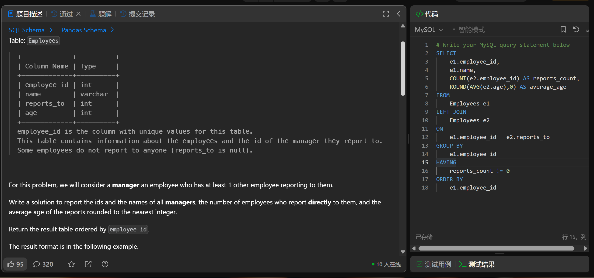

# The Number of Employees Which Report to Each Employee(1731)
- Date of practicing questions: 2026/1/23
- Difficulty: easy
- Link: [question](https://leetcode.cn/problems/the-number-of-employees-which-report-to-each-employee?envType=study-plan-v2&envId=sql-free-50)
- Question Screenshot

- takeaways
    - COUNT()是聚合函数，所以对reports_count的条件筛选要放在HAVING中
    - SQL子句执行步骤
        - FROM/JOIN → WHERE → GROUP BY → 聚合函数(COUNT/AVG) → HAVING → SELECT → ORDER BY