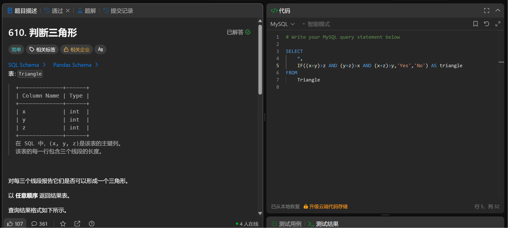

# Triangle Judgement(610)
- Date of practicing questions: 2026/2/28
- Difficulty: easy
- Link: [question](https://leetcode.cn/problems/triangle-judgement/)
- Question Screenshot

- takeaways
    - MySQL 中逻辑与不能用&&，`标准写法是AND`（&&在部分 MySQL 版本中兼容，但属于非标准写法，易报错）
    - 易忽略隐藏条件`三个边都要大于0`
    - 构成三角形的条件
        - 两边之和大于第三边`或`两边之差小于第三边`满足其一即可`
        - 若两个短边之和大于最长边，那么一定满足构成三角形的条件
    - `GREATEST(value1, value2, ..., valuen)`
        - **参数**：value1, value2,... 可以是`列名`、`常量`、`表达式`，数量≥2
        - **返回值**：返回参数中的最大值；若任意参数为NULL，则直接返回NULL
    - 更优解法
        ```SQL
        SELECT
            *,
            IF(
                x > 0 AND y > 0 AND z > 0,
                CASE 
                    WHEN GREATEST(x,y,z) < (x + y + z - GREATEST(x,y,z))
                    THEN 'Yes'
                    ELSE 'No'
                END,
                'No'
            ) AS triangle
        FROM
            Triangle;

        -- 伪代码
        -- IF 边长全为正数:
            -- 计算最长边 = GREATEST(x,y,z)
                -- 最短两边和 = x+y+z - 最长边
                -- IF 最长边 < 最短两边和:
                    -- 返回 'Yes'
                -- ELSE:
                    -- 返回 'No'
            -- ELSE:
                -- 返回 'No'
        ```
        - 注意：IF()函数的第二个和第三个参数可以是
            - 常量（如 'Yes'、123）
            - 列引用（如 x、y）
            - `表达式`（如 x+y、GREATEST (x,y,z)）
            - `流程控制语句`（如 CASE、IFNULL、CONCAT 等）