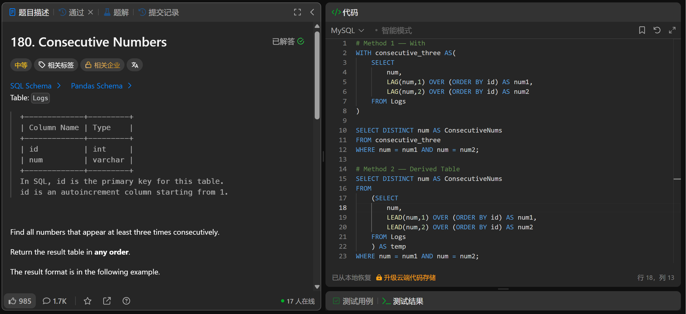

# Consecutive Numbers(180)
- Date of practicing questions: 2026/2/28
- Difficulty: middle
- Link: [question](https://leetcode.cn/problems/consecutive-numbers/)
- Question Screenshot

- takeaways
    - 派生表(Derived Table)
        - 是`FROM子句中`的子查询，MySQL会`先执行`这个子查询，生成一个`临时的、一次性的结果集（表）`，外层查询基于这个临时表做筛选、聚合、连接等操作
        - 本质是子查询的一种特殊形式（也叫`内联视图`）
        - 必须给派生表`起别名`（如`AS temp`），否则 MySQL 会直接报错
        ```sql
        SELECT 外层查询字段
        FROM (
            -- 子查询：生成派生表的逻辑
            SELECT 字段1, 字段2... 
            FROM 原表 
            [WHERE 筛选条件]
        ) AS 派生表别名  -- 必须加别名
        [WHERE 外层筛选条件]
        [GROUP BY/HAVING/ORDER BY...];
        ```
    - 窗口函数
        ```sql
        窗口函数名([列名, 偏移量, 默认值（偏移行不存在时产生的值）]) 
            OVER (
                [PARTITION BY 分组列1, 分组列2...]  -- 可选：按哪些列分组（类似GROUP），无此子句则整个表一个窗口
                [ORDER BY 排序列1 [ASC/DESC], 排序列2...]  -- 可选：窗口内的行排序
                [ROWS/RANGE BETWEEN 窗口范围]  -- 可选：定义窗口的物理/逻辑范围（比如前1行到当前行）
            ) AS 别名;
        ```
        - 在`不折叠行数的前提下`，对 “一组行（窗口）” 做`跨行计算`，既能保留每行的原始数据，又能实现分组统计、跨行对比等需求（这是`和聚合函数的核心区别`）
        - 执行顺序：FROM → WHERE → GROUP BY → 窗口函数 → HAVING → SELECT → ORDER BY
        - 窗口函数不能直接写在 WHERE 子句中，因此必须`通过派生表 / CTE` 先存储窗口函数的计算结果，再在外层查询中筛选
        - `偏移`函数
            - `LAG()`：取当前行`上一行`的数据
            - `LEAD()`：取当前行`下一行`的数据
        - `排名`函数
            - `RANK()`：跳跃排名（处理并列，跳过空位，例如1224）
            - `DENSE_RANK()`：密集排名（处理并列，不跳过空位，例如1223）
            - `ROW_NUMBER()`：为每行生成唯一的序号，即使值相同，排名也不同（按行顺序，例如1234）
        - `聚合`函数
            - AVG()
            - SUM()
            - COUNT()
