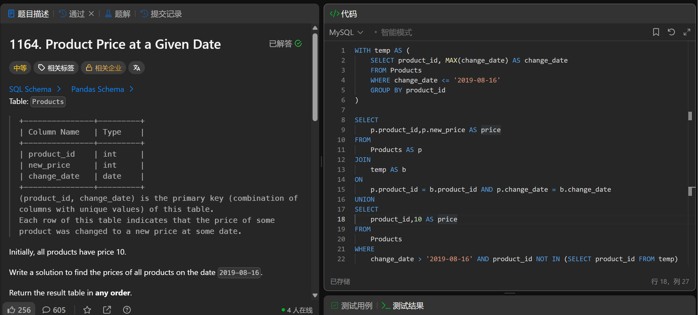

# Product Price at a Given Date(1164)
- Date of practicing questions: 2026/3/1
- Difficulty: middle
- Link: [question](https://leetcode.cn/problems/product-price-at-a-given-date/)
- Question Screenshot

- takeaways
    - GROUP BY按指定字段分组后，SELECT子句中`只能出现两类字段`
        - GROUP BY子句中明确`列出的分组字段`
        - 被`聚合函数`（SUM/COUNT/MAX/MIN/AVG 等）`包裹`的字段
    - UNION
        - 用于`合并`多个 SELECT 查询结果集
        - 核心作用是 `“纵向拼接”`（行数增加，列数不变）
        - 合并后的结果集，`列名由第一个 SELECT 语句的列名决定`，后续 SELECT 的列名会被忽略
        - 关键前提
            - 多个 SELECT 语句的`列数必须相同`
            - 且对应列的`数据类型要兼容`
        - 与UNION ALL的区别
            - `UNION会自动去重`
            - UNION会默认对结果集`按第一列升序排序`
            - UNION ALL性能更高
