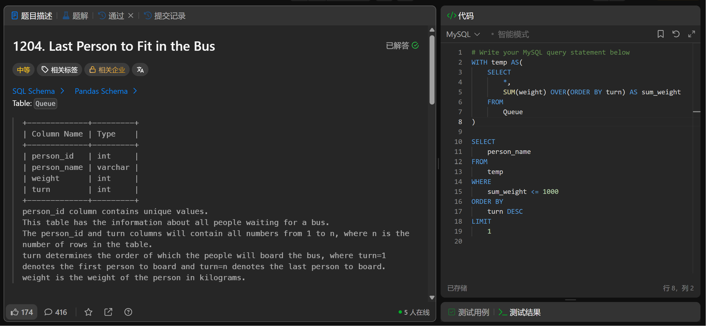

# Last Person to Fit in the Bus(1204)
- Date of practicing questions: 2026/3/1
- Difficulty: middle
- Link: [question](https://leetcode.cn/problems/last-person-to-fit-in-the-bus/)
- Question Screenshot

- takeaways
    - 当没显示指定窗口范围时，窗口函数 SUM(weight) OVER (ORDER BY turn) 中的 OVER 子句里的 ORDER BY 会触发窗口函数的 `“默认窗口范围”`，也就是`从窗口开头到当前行的累计计算`