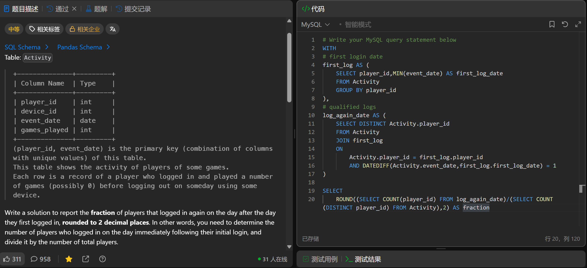

# Game Play Analysis IV(550)
- Date of practicing questions: 2026/1/22
- Difficulty: middle
- Link: [question](https://leetcode.cn/problems/game-play-analysis-iv?envType=study-plan-v2&envId=sql-free-50)
- Question Screenshot

- takeaways
    - `无 FROM 的 SELECT `仅用于「不依赖表数据」的场景（常量、计算、标量子查询）
    - COUNT(SELECT DISTINCT player_id FROM Activity) 是非法语法
        - COUNT() 函数的参数只能是`「列名 / 表达式 / 通配符 *」`，不能直接嵌套子查询
        - 正确写法：(SELECT `COUNT(DISTINCT player_id)` FROM Activity)
    - `CTE（公共表表达式Common Table Expression）`
        - 本质是临时的、命名的结果集，仅在当前查询会话中有效（执行完后自动销毁）
        - 基础结构：`WITH 开头 → 多个CTE（逗号分隔） → 主查询（必须有）`
        ```sql
        WITH
        -- 第一个CTE：定义名称 + AS + 括号包裹的查询语句
        CTE名称1 [(可选：指定列名)] AS (
            SELECT 列1, 列2,... FROM 表 WHERE 条件
        ),
        -- 第二个CTE：可引用前面定义的CTE（不能引用后面的）
        CTE名称2 [(可选：指定列名)] AS (
            SELECT 列 FROM CTE名称1 JOIN 表 ON 关联条件 WHERE 筛选条件
        )
        -- 最终主查询：必须有！否则CTE定义无意义，可引用所有已定义的CTE
        SELECT 列 FROM CTE名称1/CTE名称2 [JOIN/WHERE/ORDER BY...];
        ```
   