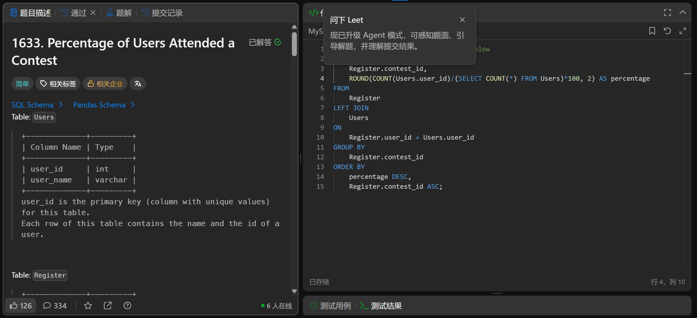

# Percentage of Users Attended a Contest(1633)
- Date of practicing questions: 2026/1/12
- Difficulty: easy
- Question Screenshot

- Detail of question

    *Table: User*
    |Column Name|Type|
    |--|--|
    |user_id|int|
    |user_name|varchar|
    
    > user_id is the primary key (column with unique values) for this table.

    > Each row of this table contains the name and the id of a user.

    *Table: Register*
    |Column Name|Type|
    |--|--|
    |contest_id|int|
    |user_id|int|
    
    > (contest_id, user_id) is the primary key (combination of columns with unique values) for this table.

    > Each row of this table contains the id of a user and the contest they registered into.

    Write a solution to find the percentage of the users registered in each contest rounded to two decimals.

    Return the result table ordered by percentage in descending order. In case of a tie, order it by contest_id in ascending order.
- takeaways
    - `嵌套子查询`来获取全局总用户数
        - (SELECT COUNT(*) FROM Users)