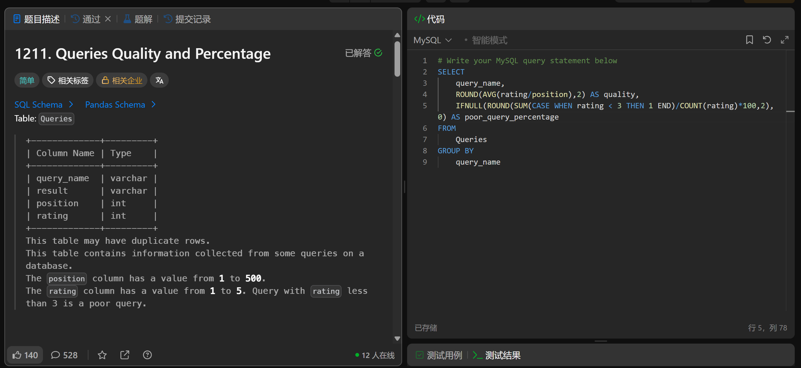

# Queries Quality and Percentage(1211)
- Date of practicing questions: 2026/1/13
- Difficulty: easy
- Link: [question](https://leetcode.cn/problems/queries-quality-and-percentage?envType=study-plan-v2&envId=sql-free-50)
- Question Screenshot

- Detail of question

    *Table: Queries*
    |Column Name|Type|
    |--|--|
    |query_name|varchar|
    |result|varchar|
    |position|int|
    |rating|int|
    
    > This table may have duplicate rows.

    > This table contains information collected from some queries on a database.

    > The position column has a value from 1 to 500.

    > The rating column has a value from 1 to 5. Query with rating less than 3 is a poor query.

    > We define query quality as: The average of the ratio between query rating and its position.

    > We also define poor query percentage as: The percentage of all queries with rating less than 3.

    Write a solution to find each query_name, the quality and poor_query_percentage.

    Both quality and poor_query_percentage should be rounded to 2 decimal places.
- takeaways
    - CASE表达式
        - 语法：
        ```sql
        CASE expression
            WHEN value1 THEN result1
            WHEN value2 THEN result2
            ...
            ELSE default_result  -- 可选，无匹配时返回NULL
        END
        ```
        - remember to write `END`
        - `all type` of SQL can use
    - 解法2：IF表达式
        - IF(rating<3,1,0)
        - can `only` be used in `MySQL`
        - 语法：
        ```sql
        IF(condition, value_if_true, value_if_false)
        ```