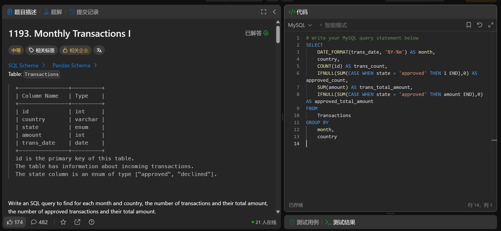

# Monthly Transactions I(1193)
- Date of practicing questions: 2026/1/13
- Difficulty: middle
- Question Screenshot

- takeaways
    - sql中怎么样获取date格式日期中的年月日?（`按年/月/日分组统计`）
        - YEAR()/MONTH()/DAY()
        - return Integer type
        ```sql
        SELECT
        YEAR(order_date) AS order_year,
        MONTH(order_date) AS order_month,
        DAY(order_date) AS order_day
        FROM orders;
        ```
    - 以不同的格式显示日期/时间数据（`按年月分组统计/按月日分组统计`）
        - `DATE_FORMAT(date, format)`
        - 关键格式符format说明：
            - %Y/YYYY：4 位年份（如 2026，推荐用 4 位避免歧义）；
            - %m/MM：2 位月份（补零，如 01、02，而非 1、2）；
            - 若想省略分隔符（如 202601），直接写 %Y%m/YYYYMM 即可
            - 常用格式：yyyy-MM-dd
    - 在标准 SQL 中，`所有字符串常量，都必须用单引号 ' 包裹`，双引号 " 并非标准的字符串定界符