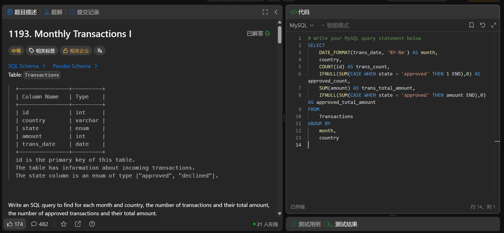

# Monthly Transactions I(1193)
- Date of practicing questions: 2026/1/13
- Difficulty: middle
- Link: [question](https://leetcode.cn/problems/monthly-transactions-i?envType=study-plan-v2&envId=sql-free-50)
- Question Screenshot

- takeaways
    - sql中怎么样获取date格式日期中的年月日?（`按年/月/日分组统计`）
        - YEAR()/MONTH()/DAY()
        - return Integer type
        ```sql
        SELECT
            YEAR(order_date) AS order_year,
            MONTH(order_date) AS order_month,
            DAY(order_date) AS order_day
        FROM orders;
        ```
    - 以不同的格式显示日期/时间数据（`按年月分组统计/按月日分组统计`）
        - `DATE_FORMAT(date, format)`
        - 关键格式符format说明：
            - 年
                %Y：4 位年 → 2026
                %y：2 位年 → 26
            - 月
                %m：2 位月 → 01,02,...,12
                %c：1 位月 → 1,2,...,12
                %M：英文月 → January
                %b：英文缩写 → Jan
            - 日
                %d：2 位日 → 01,02,...,31
                %e：1 位 / 2 位日 → 1,2,...,31
            - 时
                %H：24 小时制 → 00-23
                %h / %I：12 小时制 → 01-12
            - 分 / 秒
                %i：分钟 → 00-59
                %s / %S：秒 → 00-59
            - 星期
                %W：星期全称 → Monday
                %w：星期数字（0 = 周日）
        - `JAVA中`完全不一样，年月日时分秒为yMdH(24小时制)/h(12小时制)ms，没有%符号，几位就写几次（例如yyyy是四位年，yy是两位年）
    - 在标准 SQL 中，`所有字符串常量，都必须用单引号 ' 包裹`，双引号 " 并非标准的字符串定界符