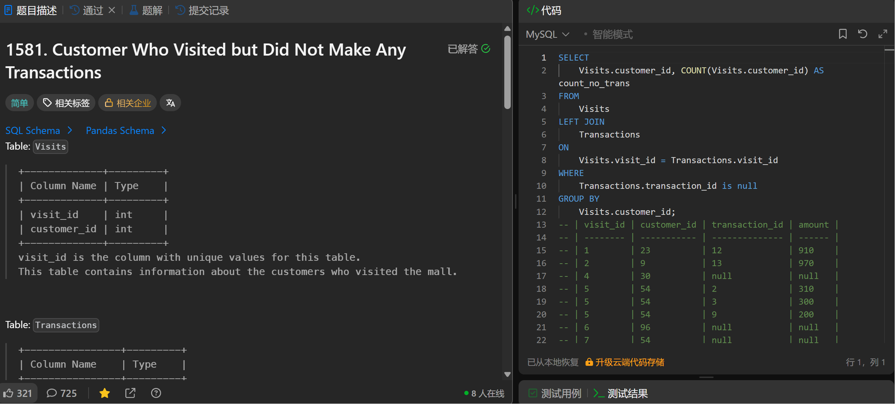

# Customer Who Visited but Did Not Make Any Transactions(1581)
- Date of practicing questions: 2026/1/10
- Difficulty: easy
- Link: [question](https://leetcode.cn/problems/customer-who-visited-but-did-not-make-any-transactions?envType=study-plan-v2&envId=sql-free-50)
- Question Screenshot

- Detail of question

    *Table: Visits*
    |Column Name|Type|
    |--|--|
    |visit_id   |int|
    |customer_id|int|

    > visit_id is the column with unique values for this table.
    This table contains information about the customers who visited the mall.
 
    *Table: Transactions*
    |Column Name|Type|
    |--|--|
    |transaction_id|int|
    |visit_id|int|
    |amount|int|

    > transaction_id is column with unique values for this table.

    > This table contains information about the transactions made during the visit_id.
 
    Write a solution to find the IDs of the users ***who visited without making any transactions*** and ***the number of times they made*** these types of visits.
- takeaways
    - 句法顺序：SELECT → FROM → JOIN → ON → `WHERE → GROUP BY → HAVING` → ORDER BY → LIMIT
    - why不用having？
        - Transactions.transaction_id IS NULL 是行级条件（筛选 “没有匹配到交易记录的访问行”），属于`GROUP BY 之前的行筛选，用WHERE`
        - `HAVING是聚合后的条件筛选`（针对GROUP BY后的统计结果，比如HAVING count_no_trans > 1），这里不需要筛选聚合结果，所以不`用HAVING`
    - COUNT 是否不计算 NULL？
        - `COUNT(列名)`：不会计算该列值为 NULL 的行
        - `COUNT(*)`：会计算所有行（包括列有 NULL 的行）

