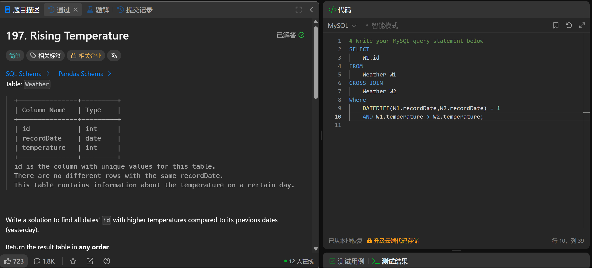

# Rising Temperature(197)
- Date of practicing questions: 2026/1/10
- Difficulty: easy
- Question Screenshot

- takeaways
    - `cross join`是交叉连接，会`返回两个表的笛卡尔积`（第一个表的每一行和第二个表的每一行都组合），行数 = 表 1 行数 × 表 2 行数（无on子句）
        - 这里不需要用交叉连接，用自连接即可
    - 自连接：`inner join`（或简写 JOIN）+ ON 子句
    - 计算两个日期的天数差（忽略时间部分）
        - `DATEDIFF(date1, date2)` → 返回 `date1 - date2 的天数`
    - 计算 timestamp 类型的时间差
        - 语法：`TIMESTAMPDIFF(单位, 时间1, 时间2)` → 返回`时间2 - 时间1 的 “单位” 数`
        - 支持的单位：DAY、HOUR、MINUTE等
        - TIMESTAMPDIFF(DAY, W2.recordDate, W1.recordDate) = 1)
        - 注意！`datediff`函数是`左边时间-右边时间`；`timestampdiff`是`右边时间-左边时间`

