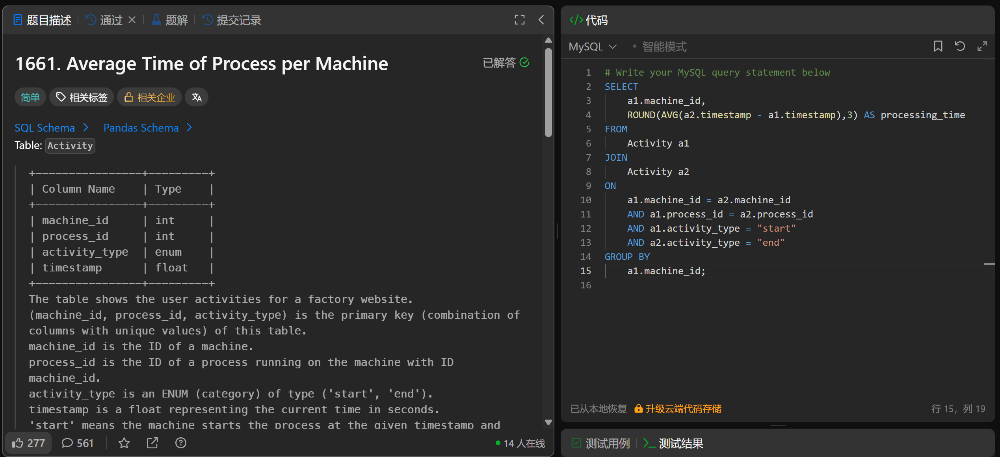

# Average Time of Process per Machine(1661)
- Date of practicing questions: 2026/1/10
- Difficulty: easy
- Link: [question](https://leetcode.cn/problems/average-time-of-process-per-machine?envType=study-plan-v2&envId=sql-free-50)
- Question Screenshot

- Detail of question

    *Table: Activity*
    |Column Name|Type|
    |--|--|
    |machine_id|int|
    |process_id|int|
    |activity_type|enum|
    |timestamp|float|

    > The table shows the user activities for a factory website.

    > (machine_id, process_id, activity_type) is the primary key (combination of columns with unique values) of this table.

    > machine_id is the ID of a machine.

    > process_id is the ID of a process running on the machine with ID machine_id.

    > activity_type is an ENUM (category) of type ('start', 'end').

    > timestamp is a float representing the current time in seconds.

    > 'start' means the machine starts the process at the given timestamp and 'end' means the machine ends the process at the given timestamp.

    > The 'start' timestamp will always be before the 'end' timestamp for every (machine_id, process_id) pair.
    
    > It is guaranteed that each (machine_id, process_id) pair has a 'start' and 'end' timestamp.
 
    There is a factory website that has several machines each running the same number of processes. Write a solution to find the average time each machine takes to complete a process.

    The time to complete a process is the 'end' timestamp minus the 'start' timestamp. *The average time is calculated by the total time to complete every process on the machine divided by the number of processes that were run*.

    The resulting table should have the ***machine_id*** along with the ***average time as processing_time***, which should ***be rounded to 3 decimal places***.
- takeaways
    - 思路
        1. 首先计算同一个机器每个进程的用时
            - 所以group by函数中只用写machine这唯一条件，不用写process
                - 当有两个分组条件时不需要用括号（），只需要用逗号`group by machine, process`
            - 限制条件“同一机器”&“同一进程”在子句on中写明
            - 此处不能用timestampdiff函数，因为时间记录并不是`标准的TIMESTAMP格式`，应该直接将两时间相减（用自连接）
            - 除了在on中声明外，还可以用where限制a1和a2分别所查找的activity_type来*确保 a2.timestamp - a1.timestamp是 end时间 - start时间*
            - on子句中多个条件用and连接
        2. 记得用`round(, 3)`函数去限制输出结果是`保留小数点后三位`的
    - `AVG()`计算所有`非null`的`数值类型`数据，搭配group by使用（否则会计算所有数据平均值）