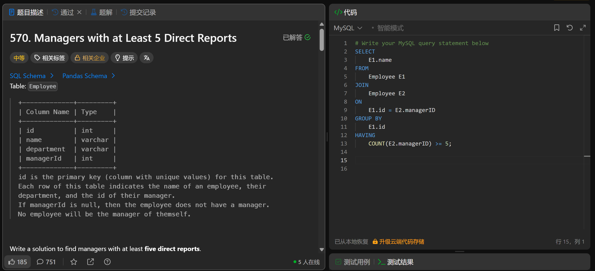

# Managers with at Least 5 Direct Reports(570)
- Date of practicing questions: 2026/1/11
- Difficulty: middle
- Question Screenshot

- takeaways
    - HAVING 是用来筛选分组后的聚合结果的，`必须搭配` GROUP BY
    - 自连接后，E1 和 E2 是两张独立的 “副本表”
    - 自连接本质是把同一张 Employee 表，复制成两张独立的表：
        - E1：我们要找的 “经理候选表”
        - E2：“所有员工表”
        - `自连接的匹配规则`：E1 取 1 行（***固定***一个员工的 id），然后***遍历*** E2 的所有行，找出所有 “managerId = E1.id” 的行，每匹配上 1 行就生成 1 条新记录；E1 的这行匹配完 E2 所有行后，再取下一行继续匹配