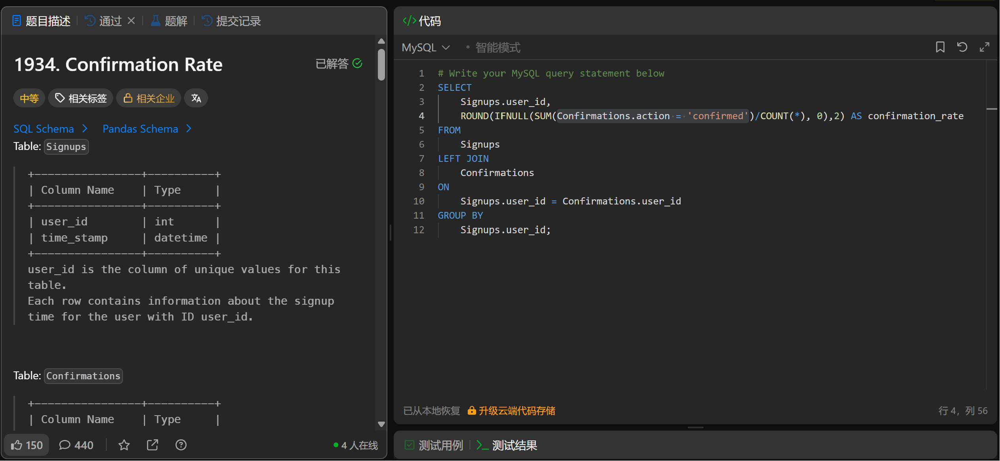

# Confirmation Rate(1934)
- Date of practicing questions: 2026/1/11
- Difficulty: middle
- Link: [question](https://leetcode.cn/problems/confirmation-rate?envType=study-plan-v2&envId=sql-free-50)
- Question Screenshot

- Detail of question

    *Table: Signups*
    |Column Name|Type|
    |--|--|
    |user_id|int|
    |time_stamp|datetime|

    > user_id is the column of unique values for this table.

    > Each row contains information about the signup time for the user with ID user_id.

    *Table: Confirmations*
    |Column Name|Type|
    |--|--|
    |user_id|int|
    |time_stamp|datetime|
    |action|ENUM|

    > (user_id, time_stamp) is the primary key (combination of columns with unique values) for this table.

    > user_id is a foreign key (reference column) to the Signups table.

    > action is an ENUM (category) of the type ('confirmed', 'timeout')

    > Each row of this table indicates that the user with ID user_id requested a confirmation message at time_stamp and that confirmation message was either confirmed ('confirmed') or expired without confirming ('timeout').

    The confirmation rate of a user is the number of 'confirmed' messages divided by the total number of requested confirmation messages.
    
     The confirmation rate of a user that did not request any confirmation messages is 0. Round the confirmation rate to two decimal places.

    Write a solution to find the confirmation rate of each user.

    Return the result table in any order.
- takeaways
    - 为什么此处用 SUM 而非 COUNT？
        - Confirmations.action = 'confirmed' 是一个*布尔表达式*
            - 表达式为`真`→ 转换成数字 `1`
            - 表达式为`假`→ 转换成数字 `0`
        - `SUM()` 本质是 “把所有行的 1/0 `相加`”
        - `COUNT` 的特性是 “统计非 NULL 值的行数”，`布尔表达式的结果不管是 1 还是 0，都会被 COUNT 统计`
    - IFNULL()
        - MySQL 专属的 “空值处理函数”，核心作用是`替换 NULL 值为指定的默认值`
        - IFNULL(待判断的表达式, 当表达式为NULL时的默认值)
        - 第二个参数必须是 “非 NULL 值”（比如 `0、''、1` 等），否则失去意义
    - MySQL 在数值上下文（比如 SUM、AVG 等聚合函数中）会`自动把布尔表达式转换成数字 1/0` 
        - [Confirmations.action = 'confirmed'这个判断语句出现在聚合函数SUM中时结果自动转换成数字 1/0]
        - 等价于 `SUM(CASE WHEN Confirmations.action = 'confirmed' THEN 1 ELSE 0 END)`， MySQL 允许省略 CASE WHEN，直接写布尔表达式
