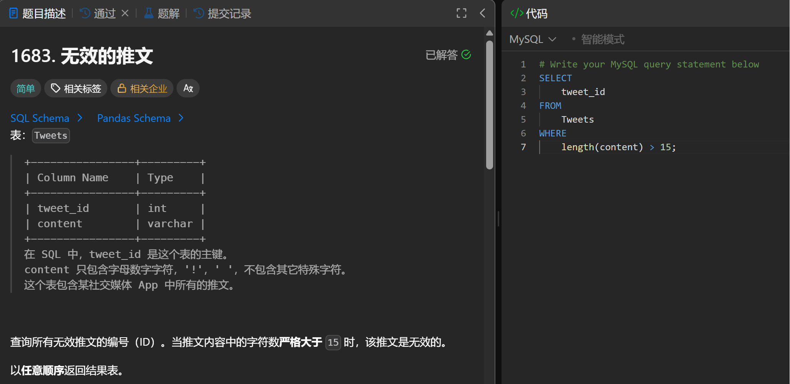

# Invalid Tweets(1757)
- Date of practicing questions: 2026/1/9
- Difficulty: easy
- Question Screenshot

- takeaways
    - 对于SQL表，用于`计算字符串中字符数`的最佳函数是 `CHAR_LENGTH(str)`，它返回字符串 str 的长度
    - LENGTH(str) 在这个问题中也适用，因为*列 content 只包含英文字符，没有特殊字符*。否则，`LENGTH()` 可能会返回不同的结果，因为该函数`返回字符串 str 的字节数`，某些字符包含多于 1 个字节
        - 以字符 '¥' 为例：CHAR_LENGTH() 返回结果为 1，而 LENGTH() 返回结果为 2，因为该字符串包含 2 个字节

