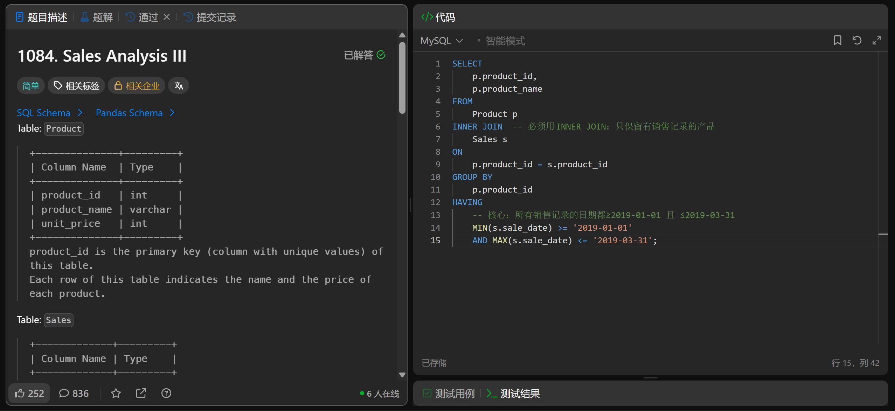

# Sales Analysis III(1084)
- Date of practicing questions: 2026/1/22
- Difficulty: easy
- Link: [question](https://leetcode.cn/problems/sales-analysis-iii?envType=study-plan-v2&envId=sql-free-50)
- Question Screenshot

- Detail of question

    *Table: Product*
    |Column Name|Type|
    |--|--|
    |product_id|int|
    |product_name|varchar|
    |unit_price|int|

    > product_id is the primary key (column with unique values) of this table.

    > Each row of this table indicates the name and the price of each product.

    *Table: Sales*
    |Column Name|Type|
    |--|--|
    |seller_id|int|
    |product_id|int|
    |buyer_id|int|
    |sale_date|date|
    |quantity|int|
    |price|int|

    > This table can have duplicate rows.

    > product_id is a foreign key (reference column) to the Product table.

    > Each row of this table contains some information about one sale.

    Write a solution to report the products that were only sold in the first quarter of 2019. That is, between 2019-01-01 and 2019-03-31 inclusive.

    Return the result table in any order.
- takeaways
    - 此处用left join也可以，但
        - 需求是 “报告被销售过的产品中，仅在 2019Q1 销售的产品”—— 无销售记录的产品本身就不符合 “被销售过” 的前提，根本不需要纳入查询范围。效率更高
    - 要找“仅仅”在限定日期售出的
        - 用MAX和MIN
        - 不能用MONTH()和YEAR()，否则无法排除那些还在其他月份售出的商品