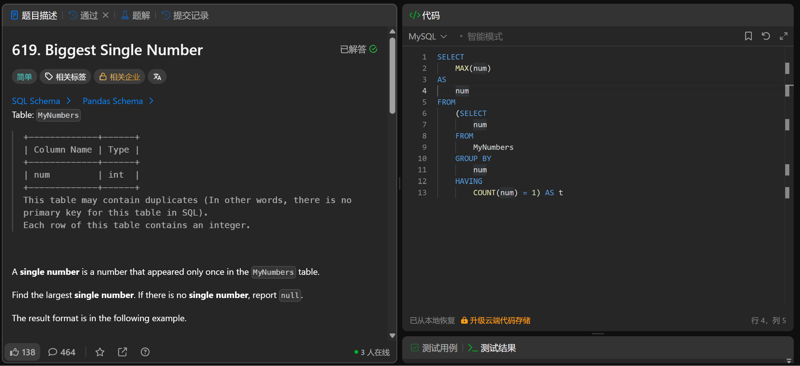

# Biggest Single Number(619)
- Date of practicing questions: 2026/1/23
- Difficulty: easy
- Question Screenshot

- takeaways
    - 把「子查询」作为派生表（Derived Table）（即把`子查询当作一个临时表来查询`）时，数据库引擎`需要一个唯一的标识符（别名）`来引用这个临时表，否则无法识别这个数据源
        - 即无AS t时会报错
        - `派生表必须有别名`
    - 当一列全为 NULL 时，MAX () 会返回 NULL
    - 只要聚合范围内有至少一个非 NULL 值，MAX () 就会返回该值的最大值