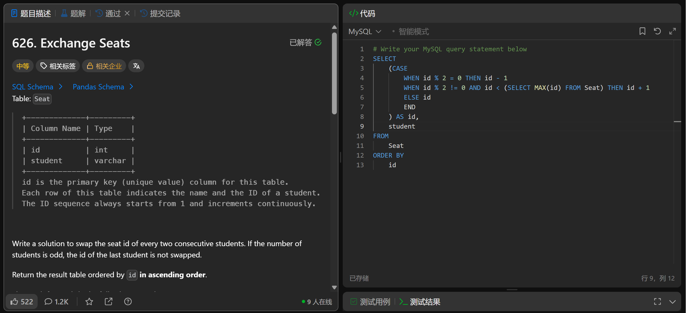

# Last Person to Fit in the Bus(1204)
- Date of practicing questions: 2026/3/2
- Difficulty: middle
- Link: [question](https://leetcode.cn/problems/exchange-seats/)
- Question Screenshot

- takeaways
    - 找规律找共性
    - SQL中无==，判断相等也是用=